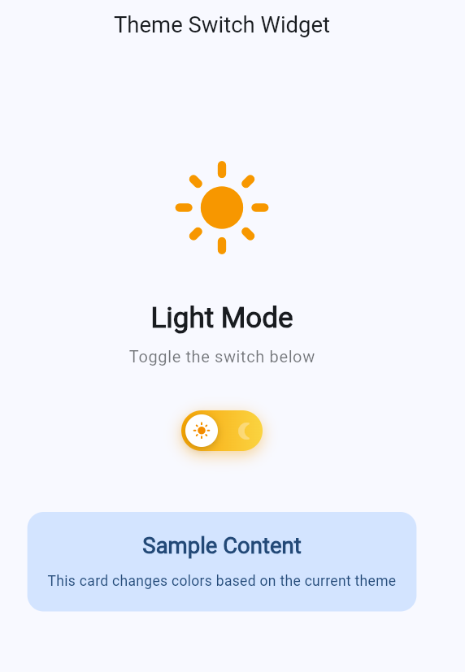

# Theme Switch Widget

A custom animated Flutter widget that lets users toggle between light and dark mode with a single tap.

## Getting Started

1. Make sure you have the [Flutter SDK](https://docs.flutter.dev/get-started/install) installed and configured.
2. Install dependencies:
   ```bash
   flutter pub get
   ```
3. Run the app in Chrome:
   ```bash
   flutter run -d chrome
   ```

## Widget Attributes

The `ThemeSwitchWidget` is built around three key attributes:

1. **`value` (bool)** – Represents the current state of the switch (`true` for dark mode, `false` for light mode). This drives the widget's colors, icons, and toggle position.
2. **`onChanged` (ValueChanged<bool>)** – A callback invoked whenever the user taps the widget, notifying the parent so it can update the app's theme (`_toggleTheme` in `MyApp`).
3. **Animated transition (implicit)** – The widget's visual state (gradient background, icon, and thumb position) animates smoothly using `AnimatedAlign` and `AnimatedSwitcher` whenever `value` changes, giving the toggle its signature sliding/fading effect.

## Screenshot


